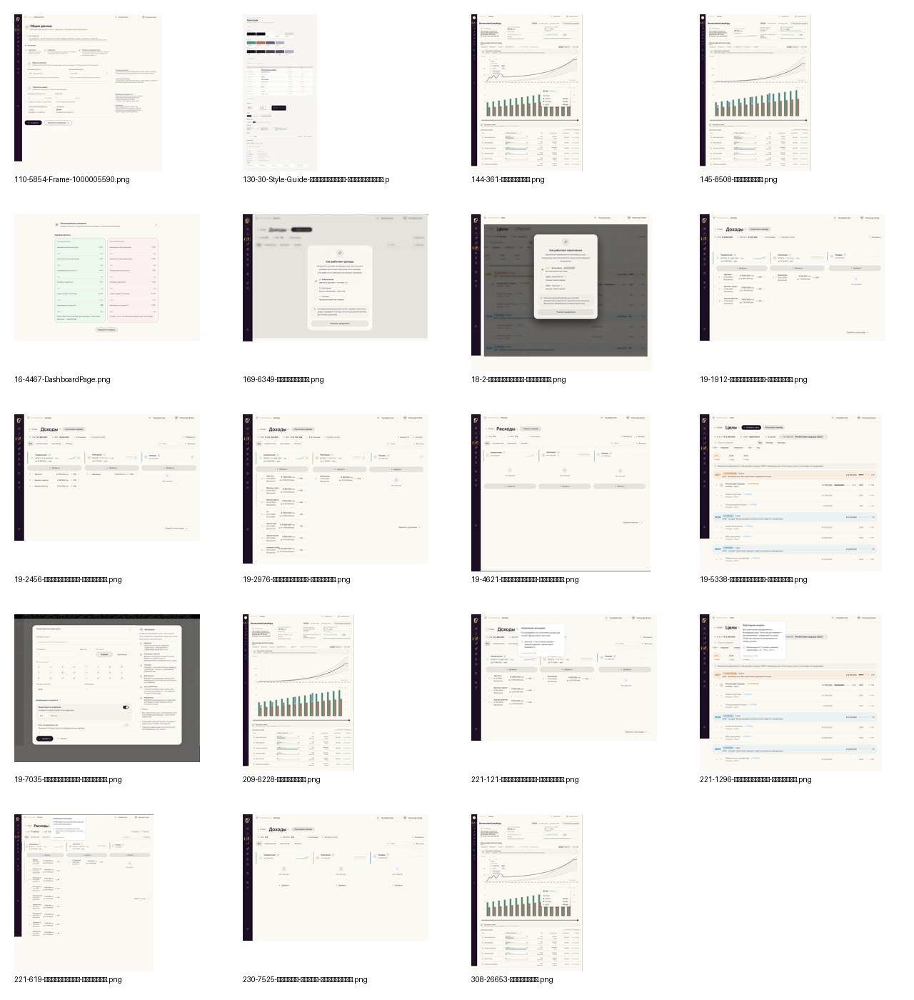
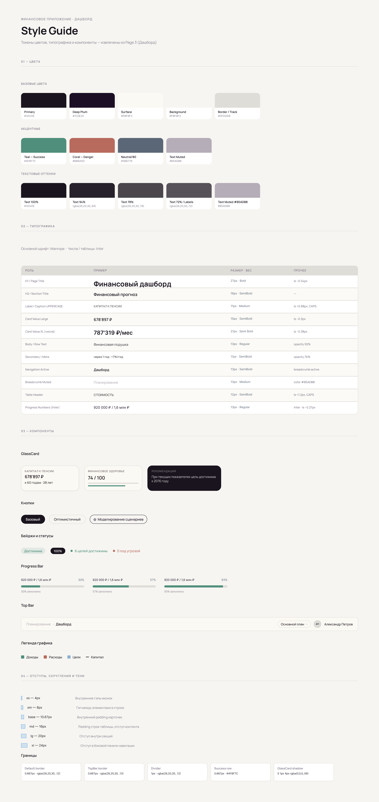
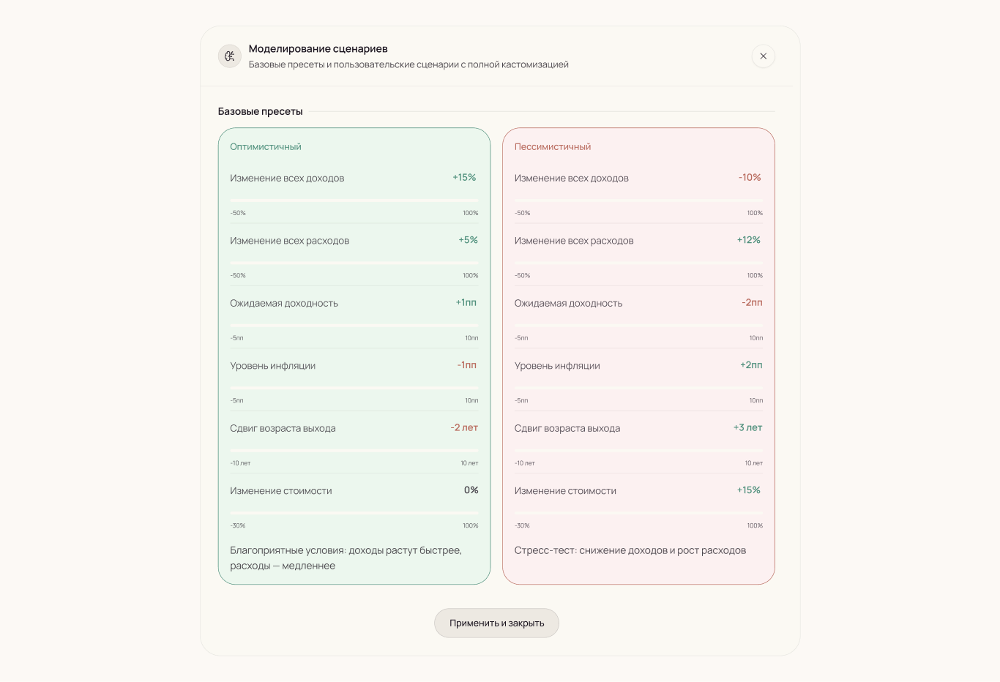
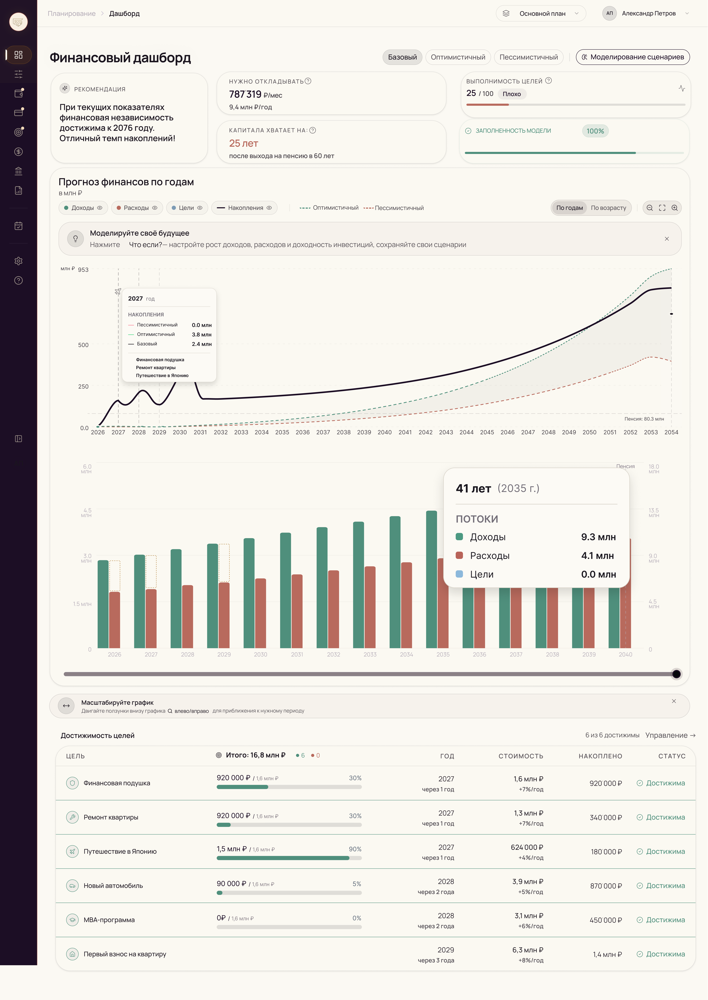
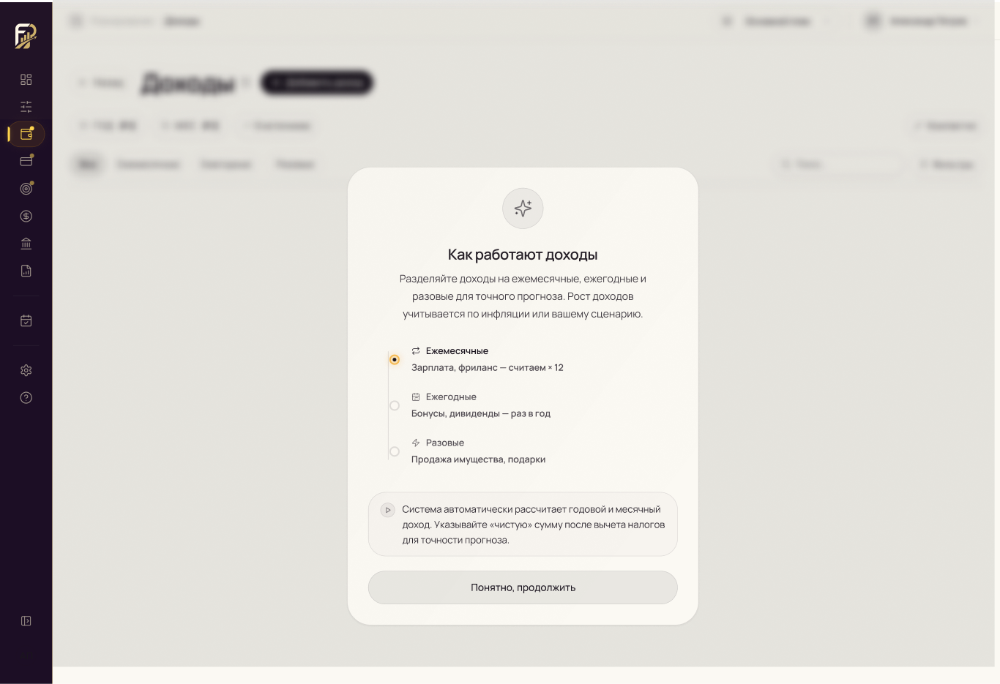

# Оценка дизайна FinPlan из Figma — 2026-05-06

Исходный файл Figma: `FinPlan` (`GVmbMjADqc5K8XivPpBuQq`), последнее изменение: `2026-05-05T09:31:55Z`.

## Итог

Дизайн доступен через Figma API, его можно применить к текущему React/Vite frontend. Правильный путь внедрения — **ручная интеграция в React**, а не прямой импорт сгенерированного Figma-кода.

## Подтверждение / скриншоты

Общий contact sheet:

Ключевые фреймы:

Дополнительные отрендеренные фреймы лежат в [`docs/design/finplan-figma-2026-05-06`](./finplan-figma-2026-05-06/).

## Найденная структура Figma

- Страница `FinPlan`: 116 объектов/фреймов верхнего уровня.
- Страница `FinPlan дубликат`: 118 объектов/фреймов верхнего уровня.
- Страница `🎨 Style Guide`: 1 фрейм со style guide.
- Компоненты/component sets: через API не отдаются.
- Стили: через API отдаются 4 remote styles (`XXS/Regular`, `XS/Regular`, `L/Regular`, `Neutral/80`).

## Направление UI

- Светлый SaaS-интерфейс с тёплым нейтральным фоном и большим количеством воздуха.
- Постоянный тёмно-фиолетовый левый sidebar.
- Скруглённые карточки, тонкие бордеры, glass/card-поверхности.
- Пастельные смысловые акценты для финансовых категорий и статусов.
- Активно используются финансовые таблицы, группировки строк, графики, tooltip, формы и onboarding/help-модалки.

## Применимость к текущему frontend

Текущий frontend уже использует:

- React 19 + TypeScript + Vite.
- TanStack Query/Router.
- Recharts.
- React Hook Form + Zod.
- Radix primitives и локальные UI-компоненты.

Этот стек совместим с новым дизайном. Существующие `AppShell`, sidebar/topbar, карточки, кнопки, input, dashboard-виджеты и page routes можно развивать, а не переписывать с нуля.

## Рекомендуемый порядок внедрения

1. Добавить дизайн-токены: цвета, типографика, радиусы, тени, spacing.
2. Обновить базовый layout shell: фон, sidebar, topbar, ширина страниц, поверхности карточек.
3. Переработать shared UI primitives: Button, Input, Select, Tabs, Card, Badge, Dialog, Tooltip.
4. Переносить страницы в таком порядке:
   - Dashboard / сводный обзор.
   - Общие данные / onboarding flow.
   - Доходы и расходы.
   - Цели и таблицы сценариев.
   - Трекер и личный кабинет/settings.
   - FAQ/help/модальные окна инструкции.
5. Добавить visual regression screenshots для ключевых страниц до/после.

## Риски / блокеры

- Figma-файл не отдаёт переиспользуемую библиотеку компонентов через API, поэтому frontend design system нужно пересобрать вручную.
- Desktop-фреймы понятны; responsive/mobile-поведение по текущим скринам не очевидно.
- Таблицы — зона максимального риска: группировки, inline-состояния, sticky headers, empty states и форматирование.
- Графикам нужны точные tooltip, legend, axes, форматирование валют/процентов.
- Часть UI-состояний отсутствует или неясна: loading, error, hover/focus, validation errors, disabled states.
- Пробелы в backend/API могут помешать полной точности для tracker, account/settings, scenarios и advanced analytics screens.

## Acceptance criteria

- [ ] Design tokens зафиксированы в `src/styles.css` / UI primitives.
- [ ] App shell соответствует новому направлению sidebar/topbar/background.
- [ ] Ключевые desktop-скриншоты Dashboard близко совпадают с Figma.
- [ ] Shared UI primitives покрывают buttons, inputs, cards, tabs, badges, dialogs, tooltips.
- [ ] Page-by-page план миграции разбит на implementation issues.
- [ ] Недостающие API/data fields вынесены в backend follow-up issues.
- [ ] Build/typecheck проходят.
- [ ] Visual screenshots приложены к каждому implementation PR/issue.
